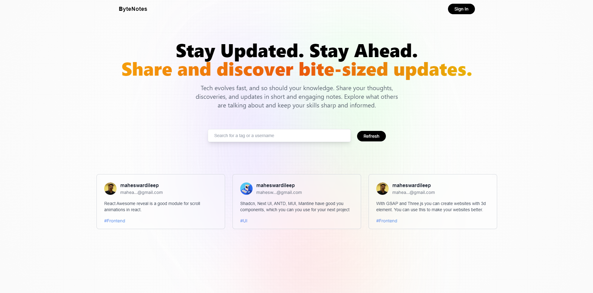

## Welcome to the Tech Updates Mini Blog! This is a project built with Next.js where users can share and stay updated with the latest happenings in the tech world.

### Features

- Post Updates: Users can share short updates about new tech releases, libraries, tools, and other tech-related news.
- Real-time Updates: Get the latest updates in real-time as they are posted by users.
- User-friendly Interface: Designed with a clean and intuitive UI for easy navigation and interaction.
- Examples

### Here are a couple of examples of what you can post:

- `React Awesome Reveal` is a great module for scroll animations in React.
- `Shadcn`, `Next UI`, `ANTD`, `MUI`, and `Mantine` offer excellent UI components for your next project.

This is a [Next.js](https://nextjs.org/) project bootstrapped with [`create-next-app`](https://github.com/vercel/next.js/tree/canary/packages/create-next-app).

## Getting Started

First, run the development server:

```bash
npm run dev
# or
yarn dev
# or
pnpm dev
# or
bun dev
```

Open [http://localhost:3000](http://localhost:3000) with your browser to see the result.

You can start editing the page by modifying `app/page.js`. The page auto-updates as you edit the file.

This project uses [`next/font`](https://nextjs.org/docs/basic-features/font-optimization) to automatically optimize and load Inter, a custom Google Font.

## Learn More

To learn more about Next.js, take a look at the following resources:

- [Next.js Documentation](https://nextjs.org/docs) - learn about Next.js features and API.
- [Learn Next.js](https://nextjs.org/learn) - an interactive Next.js tutorial.

You can check out [the Next.js GitHub repository](https://github.com/vercel/next.js/) - your feedback and contributions are welcome!

## Deploy on Vercel

The easiest way to deploy your Next.js app is to use the [Vercel Platform](https://vercel.com/new?utm_medium=default-template&filter=next.js&utm_source=create-next-app&utm_campaign=create-next-app-readme) from the creators of Next.js.

Check out our [Next.js deployment documentation](https://nextjs.org/docs/deployment) for more details.
